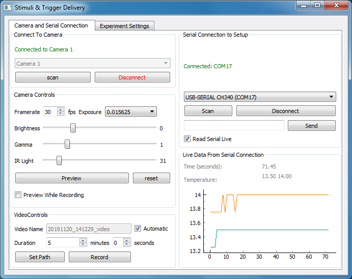

# imMobilize - Bachelor Thesis BO22EB-O4 
### This is a clone/fork of the Sars Center´s [imMobilize](https://github.com/ChatzigeorgiouGroup/imMobilize)

This is documntation for the Bachelor Thesis: BO22EB-O4 - Upgrading data acquisition system for research on Ciona Intestinalis.
Written by Dennis L. Dimmen, Andreas K. Seljeset and Håvard F. Johnsen for Chatzigeorgiou Group, Sars Center, UiB.

The original documentation is collected from [imMobilize](https://github.com/ChatzigeorgiouGroup/imMobilize) and is written by Daniel Dondorp. The new documentation is heavily based on the original, _all_ creds to Daniel and Chatzigeorgiou Group. Only some minor fixes and general cleanup is done to the original.

imMobilize consists of software and hardware designed to collect video data of small free swimming animals, and administer various stimuli in an accurate and automated manner. This system was developed for experiments with the tunicate _Ciona intestinalis_

### Hardware
For the list of hardware, schematics and buildguide, please look at the __

### Software

#### Installing imMobilize

Due to camera compatibility, imMobilize is currently only available for Windows. imMobilize is written in python and requires python 3.5+ to be installed on the system. To install imMobilize, run 
```
git clone https://github.com/havardfj/BO22EB-04-Datainnsamling/immboilize.git
```
or download this repository and extract the .zip file.

Enter the newly created directory (`cd imMobilize`) and install the required dependencies by running `pip install -r requirements`. We recommend doing this in a virtual environment.
To start the program, run
```
python3 ./imMobilize/__main__.py
```

You should see a python console and the imMobilize Camera Window open up.




##### Camera Window

In the camera window, you can connect to the cameras available on your system. The controls for the connected camera and the imaging light intensity are located on the left hand side of this window. The controls on the bottom left allow for simple video recording with the connected camera.

On the right hand side are the controls for connecting to the detected microcontrollers. The line-edit widget in this control group can be used to send commands to the microcontroller directly. Available commands are:
1. 'wS' - Switched on the white light source
2. 'wC' - Clears/Switches of the white light source
3. 'nXXXXXXXXX' - where each X is an integer 0-9. switches on coloured light. The nine provided digits are interpreted as RGB values, eg 'n000255000' switches on green light
4. 'nC' - Clears/Switches off coloured light
5. 'iXXX' -where X is an integer 000-255. Controls strength of the infrared imaging light

By activating "Read Serial Live" you can read out the temperature sensors of the specific setup live in the plot window.

##### Experiment Window
Clicking on the 'Experiment Settings' tab will get you to the Experiment Window.


In this window the user can design an experiment by adding various stimuli to the experiment timeline, and filling out the experiment metadata. Stimuli profiles can be saved and later loaded and applied to new experiments. When all settings are applied to satisfaction, clicking "Start Experiment" records a single experiment. If you wish to record multiple experiments of the same animal without coming back to the setup this can be achieved by setting the number of experiments in the "LazyMode" controls. This will repeat the set experiment a specified number of times.
